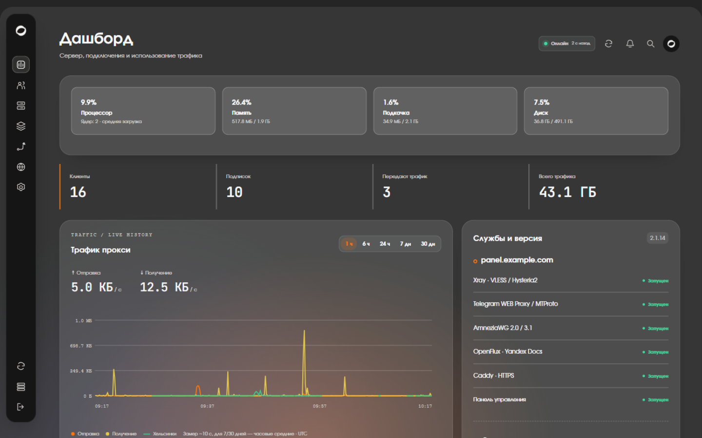
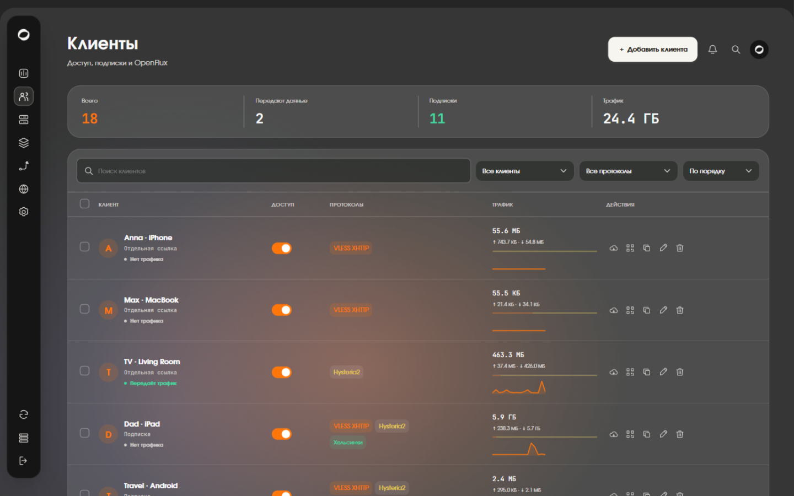
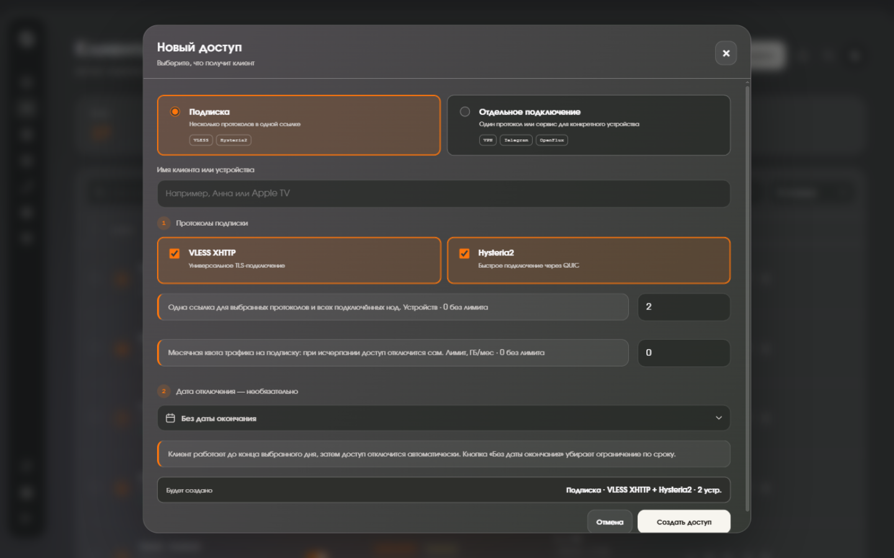
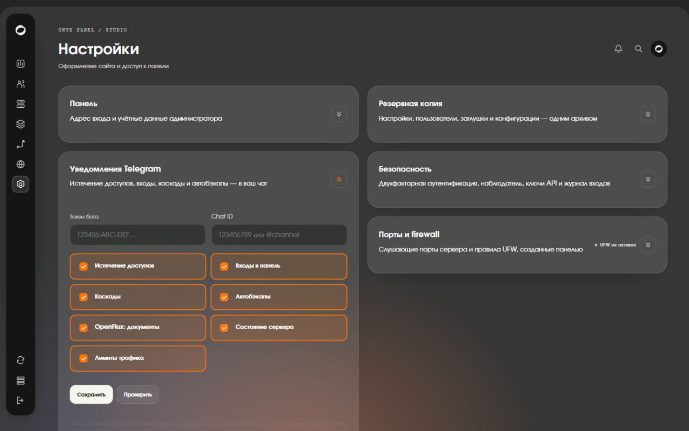
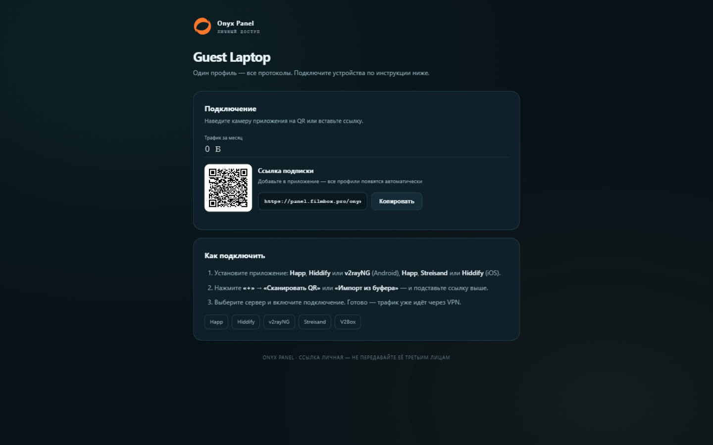
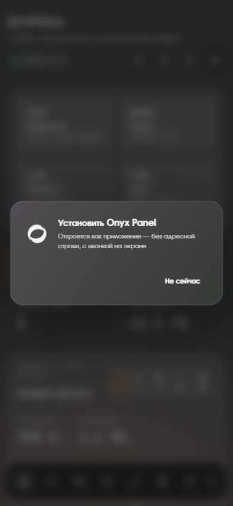

<p align="center">
  <picture>
    <source media="(prefers-color-scheme: dark)" srcset="onyx-panel-white.svg">
    
  </picture>
</p>

<p align="center"><b>Self-hosted VPN control panel for your VPS.</b><br>
VLESS XHTTP · Hysteria2 · AmneziaWG 2.0/3.1 · MTProto · Telegram Web Proxy · OpenFlux · Panel cascades · Smart routing</p>

<p align="center">
  <b>English</b> · <a href="README.ru.md">Русский</a>
</p>

<p align="center">
  <a href="https://github.com/xCodeOn/Onyx-Panel/releases/latest"></a>
  <a href="LICENSE"></a>
  <a href="https://github.com/xCodeOn/Onyx-Panel/actions/workflows/tests.yml"></a>
  
  <a href="https://github.com/xCodeOn/Onyx-Panel/stargazers"></a>
</p>

<p align="center">
  <a href="https://pay.cloudtips.ru/p/22326183"></a>
</p>

<p align="center">
  
</p>
<p align="center"><i>One-click backup to Yandex Disk — live status for every step, local and in the cloud.</i></p>

## Screenshots

<p align="center">
  <a href="docs/screenshots/dashboard.png"></a>
  <a href="docs/screenshots/clients.png"></a>
  <a href="docs/screenshots/create-client.png"></a>
  <a href="docs/screenshots/settings.png"></a>
  <a href="docs/screenshots/subscription.png"></a>
  <a href="docs/screenshots/mobile-pwa.png"></a>
</p>

## What you get

| | |
|---|---|
| **Protocols** | VLESS XHTTP (TLS via your domain) · Hysteria2 (QUIC) · AmneziaWG 2.0/3.1 with a full per-client profile · MTProto · Telegram Web Proxy · OpenFlux tunnels over public Yandex/Mail.ru documents |
| **Subscriptions** | One link for all protocols or a separate key per device · QR codes · HWID device limits · expiry dates · monthly traffic quotas visible to the client (`subscription-userinfo`) |
| **Panel cascades** | Route traffic through another panel via its `vless://` key · several cascades with priority · “everyone” or “selected clients” mode · live latency & exit-IP check · speed test · automatic failover |
| **Routing** | Direct IP/domain rules with country presets (geoip/geosite) · IPv4-only domains · torrent blocking · rules evaluated before the cascade |
| **Nodes** | Unite multiple VPS into one subscription via Node API token · live status, versions and speeds every 5 seconds |
| **Backups** | Daily archive kept locally and sent to Telegram · cloud targets — Yandex Disk, Mail.ru Cloud, Google Drive, each with its own keys (0600) · one-click “Backup now” with a live progress modal · restore with preview |
| **Monitoring** | CPU/RAM/disk/load alerts to the bell and Telegram · traffic graphs for 24 h / 7 d / 30 days · per-client sparklines · live `journalctl` streams in the browser · SSH-free diagnostics checklist |
| **Security** | TOTP two-factor auth · read-only observer account · login journal with new-device detection · UFW rules and listening ports in the panel · secret panel URL |
| **Automation** | REST API with Bearer keys for bots and billing systems · one-time invite links · panel & component updates with automatic rollback · Telegram notifications for every event |
| **Interface** | Dark glass “Flow” design · installable PWA with browser notifications · command palette (`Ctrl+K`) · landing-page editor with live preview · action journal · English & Russian UI with automatic language detection (browser Accept-Language, with a toggle in the sidebar) |

## Quick start

Connect to a clean VPS over SSH and run a single command:

```bash
bash <(curl -fsSL https://raw.githubusercontent.com/xCodeOn/Onyx-Panel/main/install.sh)
```

The installer downloads the latest stable release and sets everything up by itself — Caddy with a certificate, Xray, AmneziaWG, MTProxy, the relay and the panel. It asks for your domain, an email for the certificate and an admin login, then prints the **secret panel URL** like `https://your-domain/panel-…`. Save it: without that URL the panel does not open.

### Requirements

- A clean VPS: **Ubuntu 22.04/24.04 or Debian 12**, x86_64, root access.
- A domain with an A-record pointing to the server, ports **80/tcp and 443/tcp** free.
- Protocol ports are shown when you create clients — open them in your hosting firewall.

| Purpose | Port |
|---|---:|
| HTTP & certificate issuance | `80/tcp` |
| HTTPS, panel, VLESS, Web Proxy | `443/tcp` |
| Hysteria2 | `8443/udp` |
| MTProto | `2399–2430/tcp` (assigned on creation) |
| AmneziaWG | `52000–52999/udp` (assigned by the panel) |

Xray, Caddy, Go, AmneziaWG tools and the relay source are downloaded from official repositories during installation with checksum verification. AmneziaWG and OpenFlux binaries and Xray geo-bases ship with the package.

## Panel cascades

The panel can route traffic through another panel: clients connect to your server as usual, but reach the internet from the upstream panel's address.

1. Copy a `vless://` client key on the upstream panel (its “Clients” section).
2. In your panel open **Cascade → Add cascade** and paste the key.
3. The panel verifies the key with a live request, shows latency and the exit IP, then enables the cascade.

From there: “all VLESS and Hysteria2” or “selected clients” mode, several cascades with priority, instant disable. Keys from third-party Xray panels (TCP, WebSocket, gRPC, XHTTP, HTTPUpgrade, HTTP/2; TLS and Reality) are supported too.

## Routing

The Routing tab decides what bypasses the cascade: direct IP and domain lists (with country presets), “IPv4 only” domains and torrent blocking. Values use regular Xray rule syntax (`geoip:`, `geosite:`, `domain:`, `regexp:`), so any ready-made list works.

## Updates and backups

```bash
onyx-panel-update      # update the panel to the latest release
ONYX                   # console menu: domain, login, certificate, uninstall
onyx-panel-uninstall   # full removal
```

Everything is also available from the web UI. A backup is created automatically before every update; if the new version fails to start, the previous one is restored by itself. Components (Xray, OpenFlux) update independently — also with a run-check and rollback.

## External API

For bots and billing systems: create a key in **Settings → Security → External API keys** (the token is shown once) and send it as `Authorization: Bearer <token>`.

| Method | Path | Description |
|---|---|---|
| GET | `/api/v1/ping` | health check |
| GET | `/api/v1/clients` | list clients: traffic, status, expiry, link |
| POST | `/api/v1/clients` | create a client — `{"name":"…","protocol":"vless","devices":1}` |
| POST | `/api/v1/clients/<id>/renew` | extend access — `{"days":30}` |
| POST | `/api/v1/clients/<id>/toggle` | enable/disable — `{"enabled":false}` |
| POST | `/api/v1/clients/<id>/delete` | delete a client |
| GET | `/api/v1/clients/<id>/link` | the client's key link |

```bash
curl -s -H "Authorization: Bearer onx_…" https://your-domain/panel-…/api/v1/clients
curl -s -X POST -H "Authorization: Bearer onx_…" -d '{"name":"Friend","protocol":"vless"}' \
  https://your-domain/panel-…/api/v1/clients
```

## Security notes

- Subscription links, the Node API token and the panel URL are secrets. Never publish them.
- Backups contain access keys — store them like passwords.
- OpenFlux carries IPv4/TCP only; UDP and IPv6 do not work through it.

## Contributing

Bug reports and feature ideas are welcome — [open an issue](https://github.com/xCodeOn/Onyx-Panel/issues/new/choose). To work on the code locally, see [CONTRIBUTING.md](CONTRIBUTING.md); the test suite runs on every push.

## Support the project

The panel is free and developed in spare time. If it is useful to you, a star and a donation are the best thanks:

<p align="center">
  <a href="https://pay.cloudtips.ru/p/22326183"></a>
</p>

## License

MIT. See [LICENSE](LICENSE) for details.
